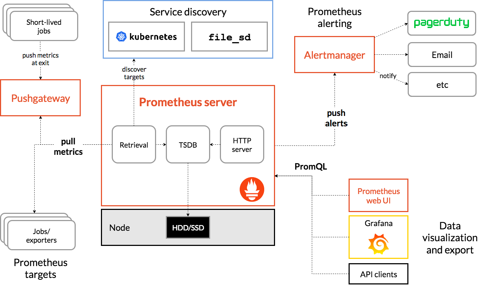

# java日常监控-Prometheus+Grafana

## Prometheus

* Prometheus 是由 SoundCloud 开源监控告警解决方案。[官方文档](https://prometheus.io/docs/introduction/overview/)
* Micrometer [官方文档](https://micrometer.io/docs)
  * Micrometer为最流行的监控系统提供了一个简单的仪表客户端外观，容许仪表化JVM应用，而无需关心是哪一个供应商提供的指标。它的做用和SLF4J相似，只不过它关注的不是Logging（日志），而是application metrics（应用指标）。简而言之，它就是应用监控界的SLF4J。

## Grafana
* Grafana 是一款采用 go 语言编写的开源应用，主要用于大规模指标数据的可视化展现，是网络架构和应用分析中最流行的时序数据展示工具，目前已经支持绝大部分常用的时序数据库。[官方文档](https://grafana.com/docs/grafana/latest/)

### Prometheus在java中的应用
> 日常工作中主要针对springboot和通用java程序进行监控，因此示例也分为普通程序代码和spring两种方式与Prometheus融合。
>
> 采用Micrometer作为Prometheus的门面，同时服用常用监控指标，并与spring对齐

#### java
1. pom.xml增加micrometer依赖
```maven
    <dependency>
      <groupId>io.micrometer</groupId>
      <artifactId>micrometer-registry-prometheus</artifactId>
      <version>${micrometer.version}</version>
    </dependency>
```
2. 初始化配置
```java
    PrometheusMeterRegistry prometheusRegistry = new PrometheusMeterRegistry(PrometheusConfig.DEFAULT);
    
    try {
        HttpServer server = HttpServer.create(new InetSocketAddress(8080), 0);
        server.createContext("/prometheus", httpExchange -> {
            String response = prometheusRegistry.scrape(); (1)
            httpExchange.sendResponseHeaders(200, response.getBytes().length);
            try (OutputStream os = httpExchange.getResponseBody()) {
                os.write(response.getBytes());
            }
        });
    
        new Thread(server::start).start();
    } catch (IOException e) {
        throw new RuntimeException(e);
    }
```

3. 增加监控 JVM 的绑定器
```java
    new JvmGcMetrics().bindTo(prometheusRegistry);
    new JvmMemoryMetrics().bindTo(prometheusRegistry);
    new JvmThreadMetrics().bindTo(prometheusRegistry);
    new ClassLoaderMetrics().bindTo(prometheusRegistry);
    new DiskSpaceMetrics(new File(".")).bindTo(prometheusRegistry);
    new LogbackMetrics().bindTo(prometheusRegistry);
    new FileDescriptorMetrics().bindTo(prometheusRegistry);
    new ProcessorMetrics().bindTo(prometheusRegistry);
    new UptimeMetrics().bindTo(prometheusRegistry);

    new ProcessMemoryMetrics().bindTo(prometheusRegistry);
    new ProcessThreadMetrics().bindTo(prometheusRegistry);
```

4. [示例代码](./src/main/java/com/clay/java/Demo.java)

#### springboot(2.x)
> [官方文档](https://docs.spring.io/spring-boot/docs/current/reference/htmlsingle/#actuator.metrics)
1. pom.xml增加micrometer依赖
```maven
    <dependency>
        <groupId>org.springframework.boot</groupId>
        <artifactId>spring-boot-actuator</artifactId>
        <version>2.4.5</version>
    </dependency>

    <dependency>
        <groupId>org.springframework.boot</groupId>
        <artifactId>spring-boot-actuator-autoconfigure</artifactId>
        <version>2.4.5</version>
    </dependency>

    <dependency>
        <groupId>io.prometheus</groupId>
        <artifactId>simpleclient_hotspot</artifactId>
        <version>0.10.0</version>
    </dependency>
```
2. application.yaml增加配置（示例）
```yaml
spring:
  application:
    name: spring-demo
management:
  endpoints:
    web:
      exposure:
        include: '*'
      #endpoints基础路径前缀，默认是/actuator
      base-path: /
  metrics:
    tags:
      application: ${spring.application.name}
  endpoint:
    health:
      show-details: always
      defaults:
        enabled: true
    heapdump:
      show-details: always
```
3. [示例代码](./src/main/java/com/clay/spring/Demo.java)

#### demo启动
> 使用docker-compose启动
1. 增加[docker-compose.yml](./docker-compose.yml)配置
2. 增加[prometheus.yml](./prometheus.yml)配置，将targets修改成当前网络的ip（非127.0.0.1，示例：192.168.199.201）
3. 使用命令启动docker：docker-compose up -d
4. 启动包含Prometheus的代码
   1. Prometheus链接: targets:9090
   2. Grafana链接: targets:3000
      1. 增加Prometheus数据源: http://targets:9090
      2. Import Dashboard: [SLS JVM监控大盘](https://grafana.com/grafana/dashboards/12856)
5. 使用命令关闭docker：docker-compose down